# Content

1. [Chapter 1: Fundamentals of Software Quality](#chapter1)
    - [Chapter 1 - Part 1: Concepts and Terminology](#chapter1part1)
    - [Chapter 1 - Part 2: Functional and Non-Functional Quality](#chapter1part2)
    - [Chapter 1 - Part 3: Software Quality Attributes](#chapter1part3)
2. [Chapter 2: Software Dependability](#chapter2)
    - [Chapter 2 - Part 1: Attributes, Threats, and Means](#chapter2part1)
    - [Chapter 2 - Part 2: Software Dependability Techniques](#chapter2part2)
3. [Chapter 3: Analysis and Formal Methods (Static)](#chapter3)
    - [Chapter 3 - Part 1: Inspections, Reviews, and Audits](#chapter3part1)
    - [Chapter 3 - Part 2: Automated Static Analysis](#chapter3part2)
    - [Chapter 3 - Part 3: Formal Methods for Specification and Verification](#chapter3part3)
    - [Chapter 3 - Part 4: Model checking](#chapter3part4)
4. [Chapter 4: Software Testing (Dynamic)](#chapter4)
    - [Chapter 4 - Part 1: Unit Testing, Integration Testing, and System Testing](#chapter4part1)
    - [Chapter 4 - Part 2: Black-box and White-box Testing](#chapter4part2)
    - [Chapter 4 - Part 3: White-box: Control-flow testing](#chapter4part3)
    - [Chapter 4 - Part 4: White-box: Data flow testing](#chapter4part4)
    - [Chapter 4 - Part 5: Black-box: Equivalence Classes](#chapter4part5)
    - [Chapter 4 - Part 6: Black-box: Boundary Value Analysis](#chapter4part6)
    - [Chapter 4 - Part 7: Other testing approaches](#chapter4part7)
    - [Chapter 4 - Part 8: Model-based Testing](#chapter4part8)
    - [Chapter 4 - Part 9: Coverage Criteria](#chapter4part9)
    - [Chapter 4 - Part 10: Testing Parallel and Distributed Systems](#chapter4part10)
    - [Chapter 4 - Part 11: Regression Testing](#chapter4part11)
    - [Chapter 4 - Part 12: Defect tracking and ODC](#chapter4part12)
5. [Chapter 5: Development Models and Standards](#chapter5)
    - [Chapter 5 - Part 1: Software Life Cycle Processes](#chapter5part1)
    - [Chapter 5 - Part 2: Software Product Quality](#chapter5part2)
    - [Chapter 5 - Part 3: Test-Driven Development](#chapter5part3)
    - [Chapter 5 - Part 4: Contract-Based Specification](#chapter5part4)
6. [Chapter 6: Certification](#chapter6)
    - [Chapter 6 - Part 1: CMMI (Capability Maturity Model Integration)](#chapter6part1)
    - [Chapter 6 - Part 2: Measuring and Estimating Software Quality](#chapter6part2)
    - [Chapter 6 - Part 3: Verification and Validation (including non-code artifacts)](#chapter6part3)
    - [Chapter 6 - Part 4: Quality Assurance](#chapter6part4)
7. [Chapter 7: Software Dependability and Security Evaluation](#chapter7)
    - [Chapter 7 - Part 1: Software Dependability and Security Evaluation](#chapter7part1)
8. [Bibliography's](#biblio)

## Chapter 1: Fundamentals of Software Quality

#### Chapter 1 - Part 1: Concepts and Terminology

**Software quality – a definition**

Software quality is the degree to which a software product meets established requirements; however, quality depends upon the degree to which established requirements accurately represent stakeholder needs, wants, and expectations.

Two aspects of software quality are presented in the above definition: one is meeting the requirements, while the other is generating customer/stakeholder satisfaction. A high quality software product is expected to meet all written development requirements – whether defined fully before the development began, or later in the course of the development process – and to meet the relevant regulations and professional conventions. Quality is also achieved through fulfillment of stakeholder needs and wants.

**Software quality assurance – a definition**

A set of activities that define and assess the adequacy of software process to provide evidence that establishes confidence that the software processes are appropriate for producing software products of suitable quality, for their intended processes, or for their intended operation services and fulfils the requirements of schedule and budget keeping.

**The objectives of SQA activities are:**

- Ensuring an acceptable level of confidence that the software product and software operation services will conform to functional technical requirements and be suitable quality for its intended use.

- According to the extended SQA definition – ensuring an acceptable level of confidence that the software development and software operation process will conform to scheduling and budgetary requirements.

- Initiating and managing activities to improve and increase the efficiency of software development, software operation, and SQA activities. These activities yield improvements to the prospects’ achieving of functional and managerial requirements while reducing costs.

**Software product definition**

A collection of components necessary to ensure proper operation, and efficient maintenance during its life cycle. The components include (1) computer programs (“code”), (2) documentation, (3) data necessary for its operation and maintenance (including standard test), and (4) procedures.

The software product components are:

- **Computer programs “the code”**: The computer programs activate the computer system to perform the required applications. The computer programs include several types

- **Procedures**: Procedures define the order and schedule within which the software or project programs are performed, the method for handling common malfunctioning of software products, and so on.

- **Documentation**: The purpose of the documentation is to instruct or support new software product version developers, maintenance staff, and end users of the software product. It includes the various design reports, test reports, and user and software manuals, and so on.

- **Data necessary for operating the software system**: The required data include lists of codes and parameters, and also standard test data. The purpose of the standard test data is to ascertain that no undesirable changes in the code or software data have occurred during bug corrections and other software maintenance activities, and to support the detection of causes for any malfunctioning.

#### Chapter 1 - Part 2: Functional and Non-Functional Quality

In software engineering the functional versus non-functional view appears at the requirements level. That is, appear at the very beginning of the development process

**Functional view**

The Functional view of a software, is what the software system does. In this view, quality is related to match between the functionalities and the user needs and/expectations

**Functional requirements**

Describes what a software system should do. Function points is a usual metric to characterize and assess the size of the software

**Non-Functional view**

Non-Functional view of a software, is the quality attribute os a software system and is how the software system does it. Most of them cannot be measured directly

**Non-functional requirements**

Define constraints (or goals) on how the system will do so. Include basically everything that is not related to the functional aspects of the software system

#### Chapter 1 - Part 3: Software Quality Attributes

This quality attributes make sense at system level, not just at program/application level. Depend on both, software and hardware and architectural design choices and
configuration choices.

 

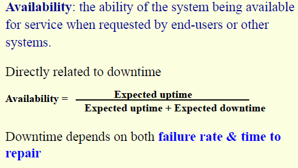 Fig 1 - Availability - (<a href='https://www.uc.pt/en/fctuc/dei'>Work by University of Coimbra - DEI - https://www.uc.pt/en/fctuc/dei </a>) 

 

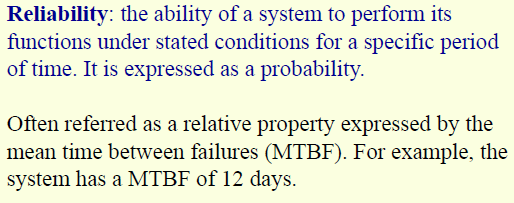 Fig 2 - Reliability - (<a href='https://www.uc.pt/en/fctuc/dei'>Work by University of Coimbra - DEI - https://www.uc.pt/en/fctuc/dei </a>) 

 

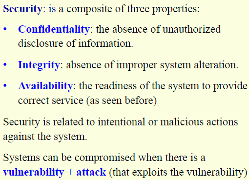 Fig 3 - Security - (<a href='https://www.uc.pt/en/fctuc/dei'>Work by University of Coimbra - DEI - https://www.uc.pt/en/fctuc/dei </a>) 

 

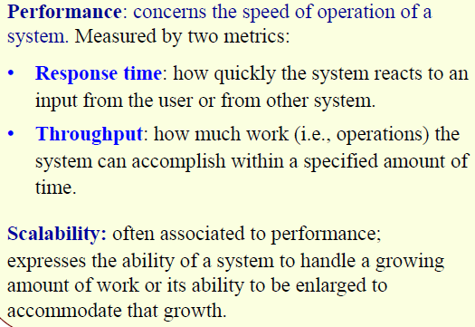 Fig 4 - Performance - (<a href='https://www.uc.pt/en/fctuc/dei'>Work by University of Coimbra - DEI - https://www.uc.pt/en/fctuc/dei </a>) 

 

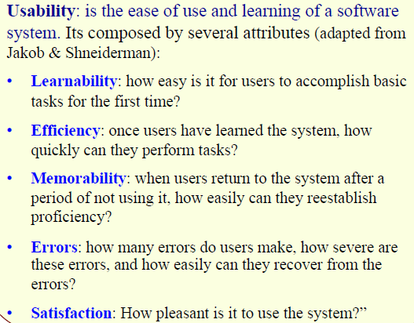 Fig 5 - Usability - (<a href='https://www.uc.pt/en/fctuc/dei'>Work by University of Coimbra - DEI - https://www.uc.pt/en/fctuc/dei </a>) 

 

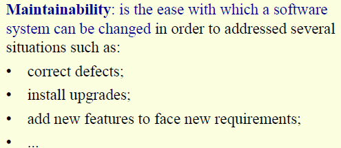 Fig 6 - Maintainability - (<a href='https://www.uc.pt/en/fctuc/dei'>Work by University of Coimbra - DEI - https://www.uc.pt/en/fctuc/dei </a>) 

 

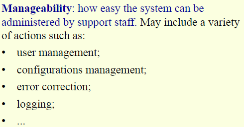 Fig 7 - Manageability - (<a href='https://www.uc.pt/en/fctuc/dei'>Work by University of Coimbra - DEI - https://www.uc.pt/en/fctuc/dei </a>) 

 

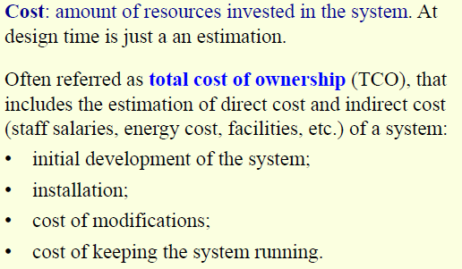 Fig 8 - Cost - (<a href='https://www.uc.pt/en/fctuc/dei'>Work by University of Coimbra - DEI - https://www.uc.pt/en/fctuc/dei </a>) 

 

**Exam Question: Explain why availability is an attribute of security. Give examples.**

Security: is a composite of three properties: **Confidentiality**, **Integrity** and **Availability**

 

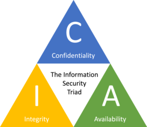 Fig 9 - Security Quality Attribute - (<a href='https://www.uc.pt/en/fctuc/dei'>Work by University of Coimbra - DEI - https://www.uc.pt/en/fctuc/dei </a>) 

 

**Confidentiality in cyber security**

When doing business with clients and prospects, it is common to collect and store their personal information. Names, email addresses and phone numbers are a few examples of personal information. This is sensitive data that your company is responsible for protecting and securing. Relying and trusting your cloud or CRM provider is not enough. Your business needs to enforce extra security measures to ensure that your clients and prospects’ privacy is safeguarded.

Protecting confidentiality can start from defining and controlling access levels of information internally and externally. For example, those who work in the IT department that typically don’t interact with clients and prospects, should not have access to client information. If someone does not need a type of information to perform their work, then they should not have access to that information.

When data accessibility is limited, you significantly lower the chances of having information being leaked accidentally or intentionally.

Examples of confidentiality risks include data breaches caused by criminals, insiders inappropriately accessing and/or sharing information, accidental distribution of sensitive information to too wide of an audience.

**Integrity in cyber security**

Integrity means that data or information in your system is maintained so that it is not modified or deleted by unauthorized parties. This is an important element of data hygiene, reliability and accuracy.

To reserve data integrity, the easiest methods are backing up your data, using access controls, monitoring your audit trail and encrypting your data.

Examples of attacks on integrity include email fraud attacks (which compromise the integrity of communications), financial fraud and embezzlement through modification of financial records, even attacks like Stuxnet that impacted the integrity of industrial control systems data flows to cause physical damage.

**Availability in cyber security**

The final component of the CIA Triad is availability. It means that systems and data are available to individuals when they need it under any circumstances, including power outages or natural disasters. Without availability, even if you have met the other two requirements of the CIA Triad, your business can be negatively impacted.

To ensure availability, your organization can use redundant networks, servers and applications. These can be programmed to become available when the primary system is broken down. Besides having backups, the design of IT architecture plays a key role as well. For instance, if high availability is a component of your IT systems, then you could maintain a certain level of operational performance for an extended period of time even in unexpected circumstances.

Examples of attacks on availability include Denial of Service attacks, Ransomware (which encrypts system data and files so they are not accessible to legitimate users), even swatting attacks which can interrupt business operations.

## Chapter 2: Software Dependability

#### Chapter 2 - Part 1: Attributes, Threats, and Means

 

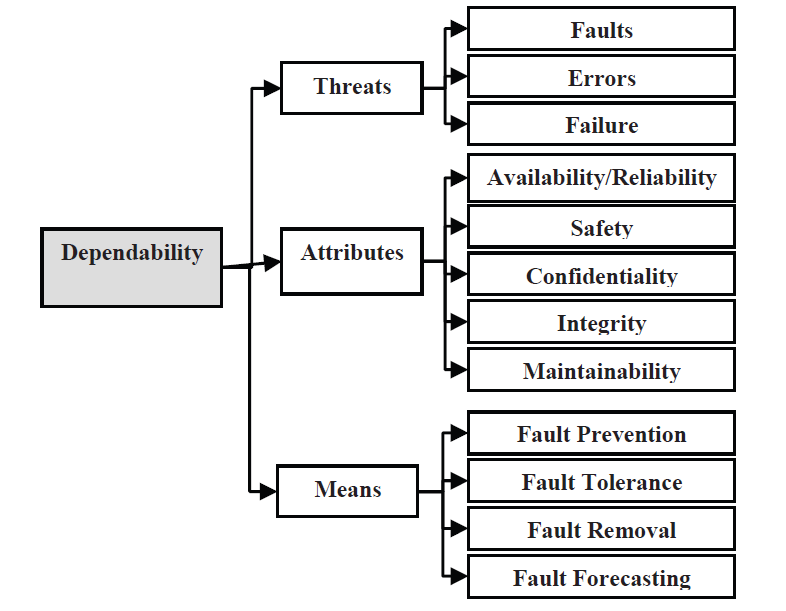 Fig 10 - Software Dependability Taxonomy - (<a href='https://www.uc.pt/en/fctuc/dei'>Work by University of Coimbra - DEI - https://www.uc.pt/en/fctuc/dei </a>) 

 

**What is Software Dependability?**

Dependability is a term proposed in 1995 by Jean-Claude Laprie to reflect the user’s confidence and degree of trust to use a software system, covering some attributes like availability, reliability, safety, confidentiality, integrity, and maintainability. Systems that are not dependable, in other words, unsafe, insecure, and unreliable, tend to be rejected by the user because they are not safe enough.

Depending on the software type, dependability is an important attribute. In Critical Systems, dependability is the most crucial property because a system’s failure may result in injury, damage, or economic losses to the environment and/or people. Examples of critical systems:

- Embedded systems in medical devices (safety-critical).

- Spacecraft navigation systems (mission-critical).

- Online money transfer systems (business critical).

Dependable software needs to be secure, and for this, it is essential to have good coverage of tests to detect, prevent, or remove all possible failures. The more dependable the software is, the more expensive it is because better and more intensive tests have to be applied.

 

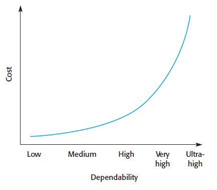 Fig 11 - Cost/dependability curve - (<a href='https://www.uc.pt/en/fctuc/dei'>Work by University of Coimbra - DEI - https://www.uc.pt/en/fctuc/dei </a>) 

 

**Software Dependability Attributes**

- **Availability**: The probability of a system being available and delivering services to users at a given time;
- **Reliability**: The ability of a system to continuously deliver services as expected by the user under predefined conditions;
- **Safety**: The ability of a system to protect against damage.
- **Confidentiality**: The ability of the system to be private and not give access for no-authorized;
- **Integrity**: The ability of a system against improper information modification or destruction;
- **Maintainability**: The ability of a system to be modified effectively and efficiently by the maintainers.

**Robustness**

The degree to which a system or component can function correctly in the presence of invalid inputs or stressful environmental conditions.

Robustness is used very often to test software interfaces such as system calls, APIs, web services, etc. This is called **robustness testing**

Robustness is defined informally as: “dependability with respect to erroneous input”

**Resilience**

The persistence of dependability when facing changes = dependability + Robustness

That is, changes include all sort of upsets:

- Hardware and software faults
- Malicious attacks
- Configuration changes
- Software and hardware upgrades

Resilience is related to robustness in that the key is unforeseen changes: The changes apply to robustness in inputs and environmental conditions, and more generally to resilience in terms of any changes that affects the service delivery of the system.

**Exam Question: If a web service crashes when called with a give combination of valid inputs, can you claim that the web service is not robust? Explain.**

**Software Dependability Threats**

 

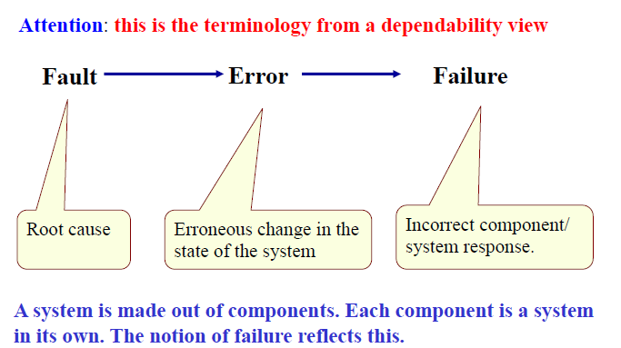 Fig 12 - Software Dependability Threats - (<a href='https://www.uc.pt/en/fctuc/dei'>Work by University of Coimbra - DEI - https://www.uc.pt/en/fctuc/dei </a>) 

 

**Fault**: A condition that may cause a system to fail in performing its required function

**Error**: A measure of the difference between the actual and the ideal.

**Failure**: The inability of a system or component to perform a required function according to its specifications

 

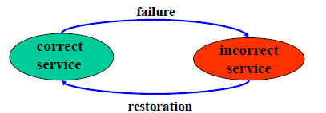 Fig 12 - Failure/Restoration - (<a href='https://www.uc.pt/en/fctuc/dei'>Work by University of Coimbra - DEI - https://www.uc.pt/en/fctuc/dei </a>) 

 

**Correct service**: is delivered when the service implements the expected system function.

**Service failure**:is an event that occurs when the delivered service deviates from correct service

**Failure**: is a transition from correct service to incorrect service

**Restoration**: the transition from incorrect service to correct service.

**Classification of faults**

Caused by what?
– Physical faults
– Human-Made faults

Why?
– Accidental faults
– Intentional non malicious faults / Intentional malicious faults

When?
– Development faults: design, coding, configuration, upgrading
– Operational faults: in use

Where (with respect to the system)?
– Internal faults
– External faults

How long?
– Permanent faults
– Transient faults

 

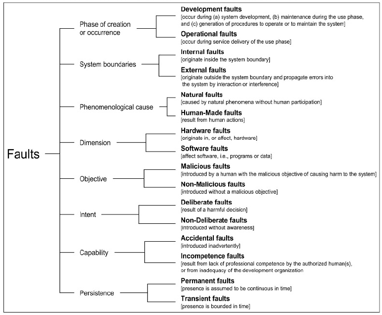 Fig 13 - Types of Software Faults - (<a href='https://www.uc.pt/en/fctuc/dei'>Work by University of Coimbra - DEI - https://www.uc.pt/en/fctuc/dei </a>) 

 

A fault can be originated in the software development process, since requirement, specification and so on...Residual software faults (bugs), originated from defects in design or implementation of software components and its integration in a system, that escape testing and other fault avoidance method.

**Different types of software faults**

Bohrbugs -> Bugs that cause failures deterministically and easiest to find during testing, 
- Fault tolerance = design diversity and redundancy

Mandelbugs -> Re-execution after a failure caused by a Mandelbug will generally not cause another failure and cery difficult to find and correct during testing
- Fault tolerance = simple retries and recovery-oriented computing using checkpointing

Aging-related -> Bugs tend to be activated and cause failures after long periods of system run-time and Difficult to find during testing (but static code analysis is effective for some of them)
- Fault tolerance = software rejuvenation

Transient fault: occurs only once and we cannot trace it later on. If we repeat the operation, the fault goes away.

Permanent fault:  is one that continues to exist until the faulty component is repaired

Intermittent fault: becomes apparent not continuously but at irregular intervals

**Software Reliability Threats** (Other terminology - Vision) 

 

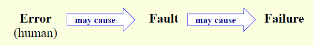 Fig 13 - Software Reliability Threats - (<a href='https://www.uc.pt/en/fctuc/dei'>Work by University of Coimbra - DEI - https://www.uc.pt/en/fctuc/dei </a>) 

 

**Error**: **Human action** that results in software containing a fault.

**Fault**: A cause for an internal error

**Failure**: any observable divergence of software behavior in execution from user needs

The origin of software failures lies in a software error made by a programmer. An error can be a grammatical error in one or more of the code lines, or a logical error in carrying out one or more of the client’s requirements.

However, not all software errors become software faults. In other words, in some cases, the software error can cause improper functioning of the software in general or in a specific application. In many other cases, erroneous code lines will not affect the functionality of the software as a whole; in a part of these cases, the fault will be corrected or “neutralized” by subsequent code lines.

We are interested mainly in the software failures that disrupt our use of the software. This requires us to examine the relationship between software faults and software failures. Do all software faults end with software failures? Not necessarily: a software fault becomes a software failure only when it is “activated” – when the software user tries to apply the specific, faulty application. In many situations, a software fault is never activated due to the user’s lack of interest in the specific application or to the fact that the combination of conditions necessary to activate the fault never occurs.

**Failure Modes**

Computer failures are normally complex, as result of the high complexity of systems and simple failure modes such as pure silent failures (clean crash or halt failures) are relatively rare.

**Failure mode**: condensed description of the way a component/computer system fails

Mainly from the operating system perspective. CRASH = Catastrophic, Restart, Abort, Silent, Hindering

- Catastrophic (OS crashes/multiple tasks affected)
- Restart (task/process hangs, requiring restart)
- Abort (task/process aborts, e.g., segmentation violation)
- Silent (no error code returned when one should be)
- Hindering (incorrect error code returned)

 

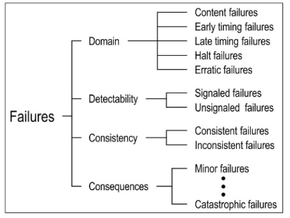 Fig 14 - Tips of Failure - (<a href='https://www.uc.pt/en/fctuc/dei'>Work by University of Coimbra - DEI - https://www.uc.pt/en/fctuc/dei </a>) 

 

The Domain can be divided into Value Failures when an improper value is computed and Timing Failures when the system delivers its service either early or late.

The Perception by Several Users can be divided into Consistent Failures when all users have the same perception of the failure or Inconsistent Failures when users have different perceptions of the failure.

The types of failures can be divided into several levels, from the most negligible to the most impactful. The consequences of lesser impact are called benign failure, and those of more significant impact is called catastrophic failure

**Software Dependability Means**

 

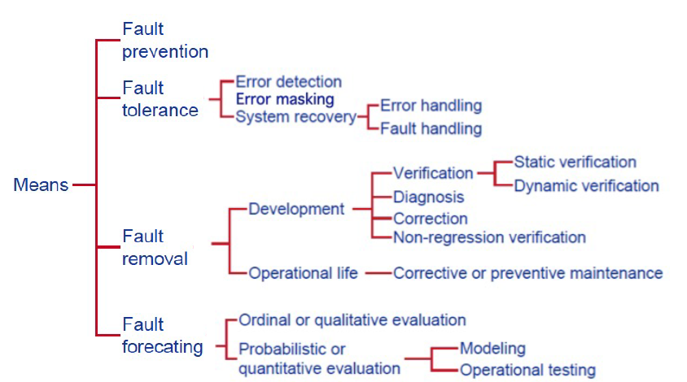 Fig 15 - Means in Dependability - (<a href='https://www.uc.pt/en/fctuc/dei'>Work by University of Coimbra - DEI - https://www.uc.pt/en/fctuc/dei </a>) 

 

**Fault Prevention**: Is the prevent the occurrence of faults. Can be attained in three phases of software development. In the requirement phase, very well gathering and documented requirements can avoid ambiguity and mistakes. In the design phase, with the use of design validations like Proof of Concepts and using standards to design the architecture and the component. In the development phase, having good development practices, doing code review, and writing unit testings covering all possibles faults. 

Fault prevention techniques intended to keep faults out of the system. Applied at the design stage
Related to general system engineering techniques (design methodologies, construction rules, use of high reliable components). Include:

- Rigid software development process
- Formal methods
- Improve development process to avoid/minimize faults Ex: V-model
- Use selected technologies (better components, certified software tools, etc. )

**Fault Tolerance techniques**: to provide correct service in presence of faults. Can be attained when the software delivers its correct service even in the presence of an active fault or when an error is detected, and the system can recover. In fault tolerance, the core business of the software has to be available, preventing a total loss of the functionalities, which can be achieved by using fault tolerance techniques like graceful degradation.

- Triple modular redundancy, N-Version programming, check pointing and recovery

**Fault Removal techniques**: specific techniques to reduce the presence of faults (number, seriousness, ...). Can be attained in the development phase and consists of a process that verifies the fault by detecting and eliminating it. This process consists of verification and validations techniques, using test cases, cross-verification, continuous integration and testing.

- Development: regression and non-regression testing, static and dynamic verification, etc
- Operation: preventive maintenance such as patches, updates, SW rejuvenation, etc.

**Fault Forecasting techniques**: to estimate the present number, the future incidence, and the consequences of faults. Can be attained using models to predict potential faults in the system. It uses static models or historical data to predict faults in some module or component that had fault occurrence.

- Probabilistic assessment, modeling, operational evaluation,…

#### Chapter 2 - Part 2: Software Dependability Techniques

 

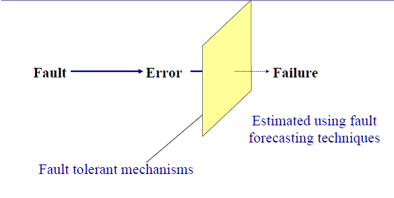 Fig 16 - Fault Tolerant - (<a href='https://www.uc.pt/en/fctuc/dei'>Work by University of Coimbra - DEI - https://www.uc.pt/en/fctuc/dei </a>) 

 

**fault tolerance** = Ability of the system to deliver a correct service after the occurrence of faults.

- **Why fault tolerance techniques?**
    Even with the most careful fault avoidance, faults will eventually occur and may result in a system failure
- **Fault tolerance techniques:**
    Carried out via error detection and system recovery, and use redundancy to counteract the effects of faults
- **Protective redundancy:**
    Additional components or processes that mask or correct errors or faults inside a system so they do not become observable failures in its service
    
– **Fault Masking**: preventing faults from introducing errors
– **Reconfiguration**: Fault detection, location, containment and recovery
    
 

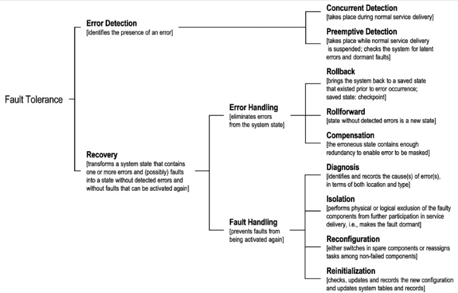 Fig 16 - Fault Tolerant - (<a href='https://www.uc.pt/en/fctuc/dei'>Work by University of Coimbra - DEI - https://www.uc.pt/en/fctuc/dei </a>) 

 

**Types of Redundancy**

- **Hardware Redundancy**: Based on physical replication of hardware
- **Software Redundancy**: The system is provided with different software versions of tasks, preferably written independently by different teams.
- **Time Redundancy**: Based on multiple executions on the same hardware in different times.
- **Information Redundancy**: Based on coding data in such a way that a certain number of bit errors can be detected and/or corrected.

**Types of Recovery**

- **forward-error recovery**: the error is masked without any computations having to be re-done
- **backward-error recovery**: periodically take checkpoints to save a correct computation state. When error is detected, roll back to a previous checkpoint, restore the correct state and resume execution

 

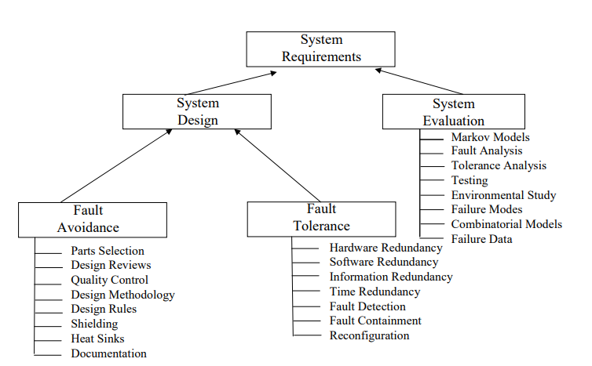 Fig 16 - Fault Tolerant - (<a href='https://www.uc.pt/en/fctuc/dei'>Work by University of Coimbra - DEI - https://www.uc.pt/en/fctuc/dei </a>) 

 

**Software redundancy techniques**

Two Ways: 

– Add extra lines of code and data structures to:
    – Check the acceptable range of variables or magnitude of signals, or a routine to test a memory by writing and reading locations, etc.
    – Perform error recovery.
    
– Replicate program modules or the complete program

**Consistency checks**

- Uses a priori knowledge about the characteristics of information to verify its correctness.

- Often called assertions (program assertions, executable assertions)

Examples: **Data consistency**: check the range of variables, input parameters, signals, etc.
          **Address consistency**: check the addresses generated by the computer in the address range of the available memory.
          **Time consistency**: check time limits for given operations, such as timeouts
          **Detection of invalid instruction codes** (n bit to represent 2k legal instruction codes: 2n - 2k are illegal)
          
 **Capability check**
 
 Verify that a system has the expected capability (hardware testing)
 
 Memory test: write and read some locations
 
 **Software diversity**
 
 Independently developed versions of design and code from the same set of requirements.
 
 Technique: independently design teams utilizing different design methodologies, algorithms, compilers, run-time systems and hardware components
 
 Vote on the N results produced
 
 **Error recovery**
 
 **Forward recovery**: transform the erroneous state in a new state from which the system can operate
 
 **Backward recovery**: bring the system back to a state prior to the error occurrence
 
 - Checkpointing
 - Recovery block

 **Error Detection**
 
 **Structural approach** (duplication and comparison)
– Two or more copies of data item that may be corrupted
– A mechanism that compares them and declares an error if differ
– The two copies must be unlikely to be corrupted together in the same way

**Behavior based approach**

– Execution of checks on the behavior (variables, results, etc.) of the target system. The checks use a simplified view of the target behavior (behavior abstraction)
– The detection is done by a separate mechanisms called, in general, watchdog. In some implementations, the watchdog requires specific hardware.
– Watchdog can range from a simple watchdog times to complex watchdog processors

## Chapter 3: Analysis and Formal Methods (Static)

#### Chapter 3 - Part 1: Inspections, Reviews, and Audits

#### Chapter 3 - Part 2: Automated Static Analysis

#### Chapter 3 - Part 3: Formal Methods for Specification and Verification

#### Chapter 3 - Part 4: Model checking

## Chapter 4: Software Testing (Dynamic)

#### Chapter 4 - Part 1: Unit Testing, Integration Testing, and System Testing

The idea is a dynamic approache to running the code to test it

Software testing is a critical element of software quality assurance and represents the ultimate review of:
    – specification;
    – design;
    – coding.
    
Software life-cycle models (e.g., waterfall) frequently include software testing as a separate phase that follows implementation

Contrary to some life-cycle models, testing is an activity that must be carried out throughout the life-cycle.

It is not enough to test the end product of each phase. Ideally, testing occurs during each phase.

**Testing phases**

- **Unit testing** = Test of individual units of source code. The definition of “unit” for test purposes depends on the actual software. It is done by the programmer most of the times

- **Integration testing** = Units are combined and tested as a whole. Typically black-box testing.

- **System testing (and Alpha testing)** = The testing team plays the role of end-users. The test is executed in the developers’ site.

- **Beta testing** = A beta version of the software is released to be used by external users (beta testers).

- **Acceptance testing** = Determined by contract. Confirms that the solution works for the customer

**Types of Testing**

- **Functional**

- **Non-functional**:
    - Performance: test the run-time performance of the software.
    - Stress: execute a system in a manner that demands resources in abnormal quantity, frequency, or volume.
    - Usability: attempt to identify discrepancies between the user interfaces of a product and the human engineering requirements of its potential users
    - Security: verify that protection mechanisms built into a system will, in fact, protect it from improper penetration
    - Dependability: operate the system for long periods of time and estimate the likelihood that the the requirements for failure rates, mean-time-between-failures, and so on, will be satisfied. -> Very Dificult
    - Specific non-functional elements: Error detection, Intrusion detection, Checkpointing, Logging, Recovery

**Elements of Testing**

- **Test case**: inputs to test the program and the predicted outcomes (according to the specification). Test cases are formal procedures:
    - inputs are prepared;
    - outcomes are predicted;
    - tests are documented;
    - commands are executed;
    - results are observed and evaluated.

- **Test suite**: A collection of test cases

- **Testing oracle**: A mechanism (a program, process, or set of data) that helps us determine whether the program produced the correct outcome or not.

- **Outcome**: What we expect to happen as a results of the test. In practice, outcome and output may not be the same.
    - Example: if the screen did not change as a result of a test that is a tangible outcome although there is no output.
    - In testing we are concerned with outcomes, not just outputs.

    - Some times, specifying the expected outcome for a given test case can be quite difficult:
        - For some applications we might not know what the outcome should be.
        - For other applications the developer might have a misconception.
        - Or the program may produced too much output to be able to analyze it in a reasonable amount of time.
    
    - In general, this is a fragile part of the testing activity, and can be very time consuming.
    
    - When possible, automation should be considered as a way of specifying the expected outcome, and comparing it to the actual outcome.

- **Question**: When does a test “succeed”? When does a test “fail”?
    - A successful test is a test that discovers one or more faults.

**Coincidental correctness**: A program is said to be coincidentally correct if the test results in the expected outcome, even though the program performs the incorrect computation.
    - Example: A program calculates y = x2. It is incorrectly programmed as y = 2x, and it is tested with the input value x = 2.

**Software testing axioms**
       
    - 1 It is impossible to test a program completely.
    - 2 Software testing is a risk-based exercise.
    - 3 Testing cannot show the absence of bugs.
    - 4 The more bugs you find, the more bugs there are.
    - 5 Not all bugs found will be fixed.
    - 6 It is difficult to say when a bug is indeed a bug.
    - 7 Specifications are never final.
    - 8 Software testers are not the most popular members of a project.
    - 9 Software testing is a disciplined and technical profession
    
 When modifying existing code to either correct an existing problem or otherwise enhance the program. For this, we need **Retest** or **Regression test**
 
 - **Retest**: test to verify that a corrected bug was effectively corrected
 - **Regression test**: retest to verify if other code (i.e., not the one that has been modified) still works after the modifications introduced to correct a bug or to add new functionalities..

**Limitations of testing**

- Testing cannot occur until after the code is written.
- The problem is big!
- Exhaustive testing is not practical even for the simplest programs.
- Even if we “exhaustively” test all execution paths of a program, we cannot guarantee its correctness. The best we can do is increase our confidence!
- “Testing can show the presence of bug, not their absence.” Dijkstra
- Testers do not have immunity to bugs.
- Even the slightest modifications – after a program has been tested – invalidate (some or even all of) our previous testing efforts.
- Lack of testing tools

**Testing versus debugging**

- The **purpose of testing** is to show that a program has bugs.
- The **purpose of debugging** is to find the faults that led to the program failure and to design and implement the program changes that correct the faults.
- Testing is a demonstration of failure or apparent correctness.
- Debugging is a deductive process
- Testing can be automated to a large extent
- Automatic debugging is (still) a dream.
- Much of testing can be done without design knowledge (by an outsider).
- Debugging is impossible without detailed design knowledge (by an insider).

**Designer versus tester**

- The more the tester knows about the design, the more likely he will eliminate useless tests (functional differences handled by the same code).
- Testers that have design knowledge may have the same misconceptions as the designer.
- Lack of design knowledge may help the tester to develop test cases that a designer would never have thought of.
- Lack of design knowledge may result in inefficient testing and blindness to missing functions and strange cases.

**Testing priorities**

- Only exhaustive testing can show a program is free from defects. However, exhaustive testing is impossible
- The problem is to decide what should be tested first or more intensively
- Some examples
    - System wide functionalities vs component functionalities
    - Old functionalities vs new functionalities
    - Typical situations vs corner cases.
    - More complex code vs simpler code

#### Chapter 4 - Part 2: Black-box and White-box Testing

**White-box (Glass-box or Structural) testing**: testing techniques that use the source code as the point of reference for test selection and adequacy. Structural testing includes **control flow** testing and **data flow** testing
    - a.k.a. program-based testing, structural testing and data driven test
    
- Looks at implementation details
- Aims at exercising the different control and data structures used in the program (control flow testing and data flow testing).
- Requires the programmer knowledge of the source code
- Criteria are quite precise as they are based on program structures and data structures.
- Assumes that the source code fully implements the specification.
    
**Black-box (or functional) testing**: testing techniques that use the functional specification as the point of reference for test selection and adequacy. **Class partitioning** and **boundary value analysis**
    - specification-based testing, functional testing
    
 - Testing software against a specification of its external behavior without knowledge of internal implementation details
    - Can be applied to software “units” (e.g., classes) or to entire programs
    - External behavior is defined in functional specs, requirements specs, API docs, etc.

 - As black box testing purposely disregards the program structure, attention is focused primarily on the information domain (i.e., data that goes in, data that comes out)

- Goals:
    - Derive test cases (sets of input conditions and expected output) that fully exercise the functionality, as seen by an external point of view
    - Define effective test cases that represent the potentially infinite input space.

- Black box testing tends to find different kinds of errors than white box testing
    - Missing functionalities
    - Usability problems
    - Performance problems
    - Concurrency and timing errors
    - Initialization and termination errors
    
- Unlike white box testing, black box testing tends to be applied later in the development process

- Inputs:
    - Individual input values
        - Try several different values for each individual input (the goal is to select the best ones, since the input domain is normally very large)
    - Combinations of inputs
        - Individual inputs are not independent from each other
        - Programs process multiple input values together, not just one at a time
        - Try many different combinations of inputs in order to achieve good coverage of the input domain
    - Ordering and timing of inputs
        - In addition to the particular combination of input values chosen, the ordering and timing of the inputs can also make a difference
    - Boolean value
        - T or F
    - Numeric value in a particular range
        - -99 <= N <= 99
        - Integer, Floating point
    - One of a fixed set of enumerated values
        - {Jan, Feb, Mar, …}
        - {Visa, Master Card, American Express, …}
    - Formatted strings
        - Phone numbers
        - File names
        - URLs
        - Credit card numbers
        - Regular expressions
    
**Test coverage: how to measure it?**

Software reliability increse cost, but bugs in system can increase too.

 

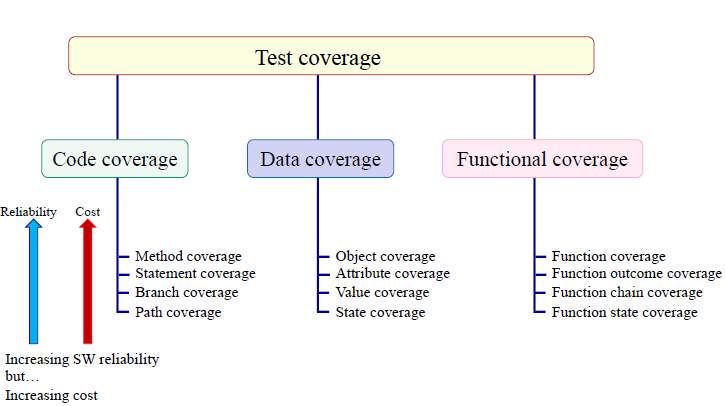 Fig 17 - Test Coverage - (<a href='https://www.uc.pt/en/fctuc/dei'>Work by University of Coimbra - DEI - https://www.uc.pt/en/fctuc/dei </a>) 

 

**White-box versus black-box testing**

- The real difference between white-box and black-box testing is how test cases are generated and how adequacy is determined -> **Test case = inputs + expected outcome**
- In both cases, usually, the correctness of the program being tested is done via specifications
- Neither can be exhaustive
- Each techniques has its strengths and weaknesses

**Is complete testing possible?**

- NO. Complete testing is both practically and theoretically impossible for non-trivial software.

**Complete functional testing**

- A complete functional test would consist of submitting all possible input streams to the program under test.
- Even if the program has an input stream of 10 characters, it would require 280 tests.
- At 1 microsecond/test, exhaustive functional testing would require more time than twice the current estimated age of the universe!

**Complete structural testing**

- One should design enough tests to ensure that every path is executed at least once.
- The number of paths may be too large.
- Executing a program path does not assure program correctness.

**Small versus large systems**

- For small systems with one user, quality assurance may not be a major concern.
- As systems scale up in size and number of users, quality assurance becomes more of a concern.
- As systems dramatically scale up in size (e.g., millions of lines of code), our quality criteria may have to change as exhaustive testing may not be economically possible. E.g., a 75% code coverage may be acceptable.

**Typical testing strategies**

- Divide-and-conquer. Begin by ‘testing-in-the-small’ and move toward ‘testing-in-the-large’
- For conventional software:
    - The module (component) is our initial focus
    - Integration of modules follows

- Identify the appropriate testing phases for the given release, and the types of testing that need to be performed.
- Prioritize the testing activities.
- Plan how to deal with “cycles”.
    
#### Chapter 4 - Part 3: White-box: Control-flow testing

- **Control-flow testing** is a structural testing strategy that uses the program control flow as a model.
- Control-flow testing techniques are based on judiciously selecting a set of test paths through the program
- The set of paths chosen is used to achieve a certain measure of testing completeness. For example
    - Select paths to assure that every source statement is executed at least once.
    - Select paths to achieve complete branch coverage

- Control-flow testing is most applicable to new software for unit testing.
- Control-flow testing assumptions:
    - specifications are correct and fully implemented in the code
    - data is defined and accessed properly
    - there are no bugs other than those that affect control flow

- Structured and OO languages reduce the number of control-flow bugs.

**Control flow graphs (CFG)**

- The control flow graph is a graphical representation of a program control structure

Three primitives:
    - A decision is a program point at which the control can diverge.
        - (e.g., if and case statements).
    - A junction is a program point where the control flow can merge.
        - (e.g., end if, end loop, goto label)
    - A basic block is a sequence of program statements uninterrupted by either decisions or junctions. (i.e., straight-line code).
        - A basic block has one entry and one exit.
        - A program does not jump into or out of a basic block.

 

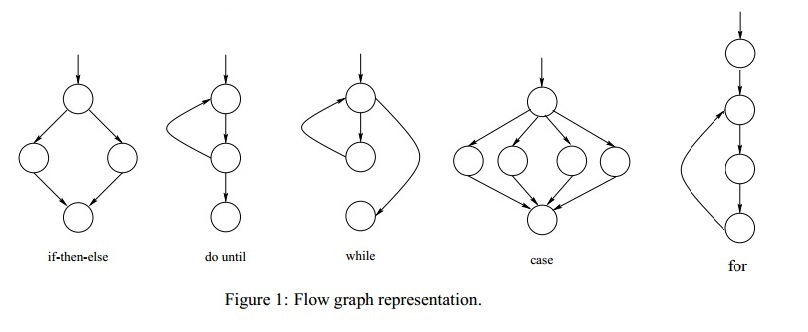 Fig 18 - Control Flow Graph - (<a href='https://www.uc.pt/en/fctuc/dei'>Work by University of Coimbra - DEI - https://www.uc.pt/en/fctuc/dei </a>) 

 

 Fig 18 - Control Flow Graph - (<a href='https://www.uc.pt/en/fctuc/dei'>Work by University of Coimbra - DEI - https://www.uc.pt/en/fctuc/dei </a>) 

 

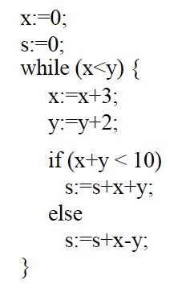 Fig 18 - Control Flow Graph - (<a href='https://www.uc.pt/en/fctuc/dei'>Work by University of Coimbra - DEI - https://www.uc.pt/en/fctuc/dei </a>) 

 

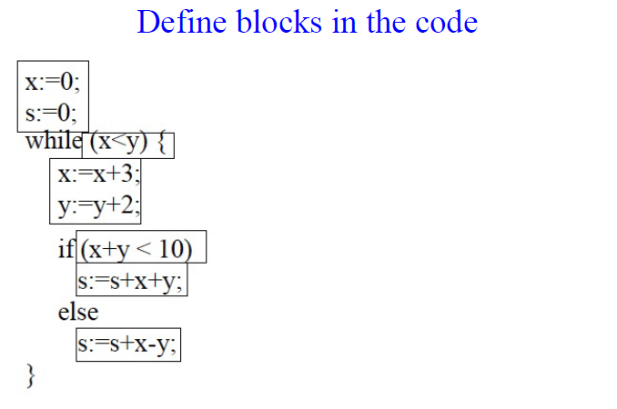 Fig 18 - Control Flow Graph - (<a href='https://www.uc.pt/en/fctuc/dei'>Work by University of Coimbra - DEI - https://www.uc.pt/en/fctuc/dei </a>) 

 

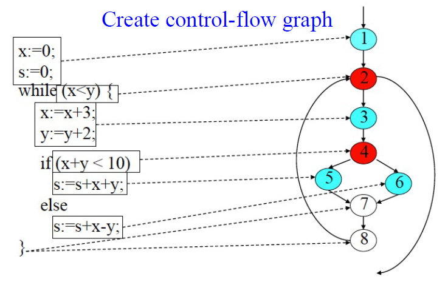 Fig 18 - Control Flow Graph - (<a href='https://www.uc.pt/en/fctuc/dei'>Work by University of Coimbra - DEI - https://www.uc.pt/en/fctuc/dei </a>) 

 

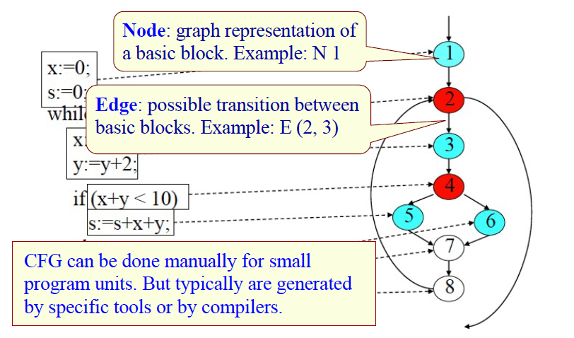 Fig 18 - Control Flow Graph - (<a href='https://www.uc.pt/en/fctuc/dei'>Work by University of Coimbra - DEI - https://www.uc.pt/en/fctuc/dei </a>) 

 

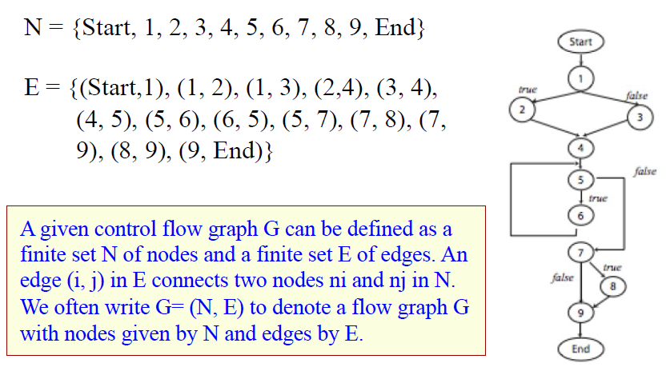 Fig 18 - Control Flow Graph - (<a href='https://www.uc.pt/en/fctuc/dei'>Work by University of Coimbra - DEI - https://www.uc.pt/en/fctuc/dei </a>) 

 

**Paths**: Consider a flow graph G = (N, E). A sequence of k edges, k > 0, (e_1, e_2, … e_k) , denotes a path of length k through the CFG if the following sequence condition holds:
    Given that np, nq, nr, and ns are nodes belonging to N, and 0 < I < k, if ei = (np, nq) and ei + 1 = (nr, ns) then nq = nr. }
    
 

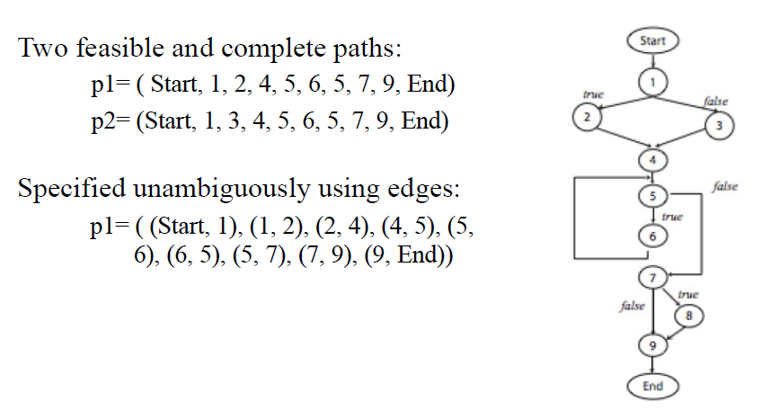 Fig 18 - Control Flow Graph - (<a href='https://www.uc.pt/en/fctuc/dei'>Work by University of Coimbra - DEI - https://www.uc.pt/en/fctuc/dei </a>) 

 

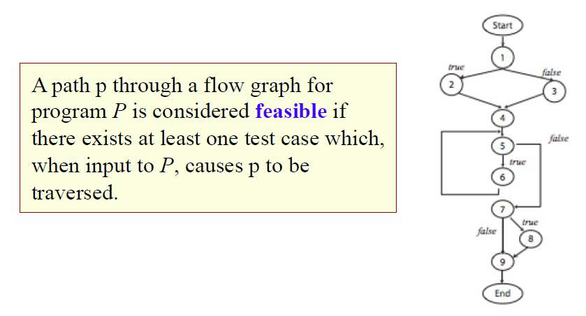 Fig 18 - Control Flow Graph - (<a href='https://www.uc.pt/en/fctuc/dei'>Work by University of Coimbra - DEI - https://www.uc.pt/en/fctuc/dei </a>) 

 

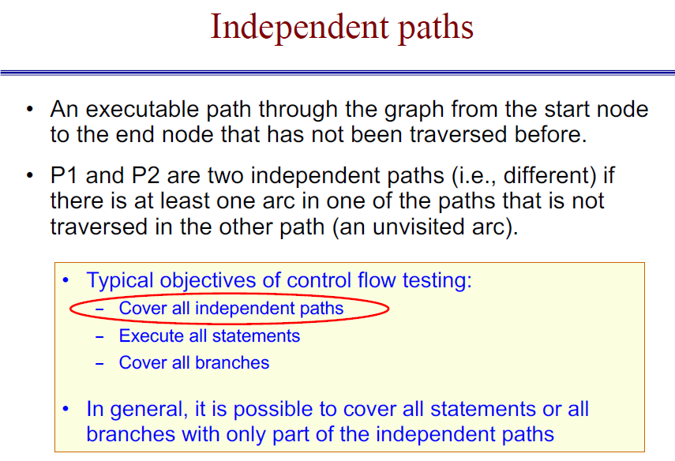 Fig 18 - Control Flow Graph - (<a href='https://www.uc.pt/en/fctuc/dei'>Work by University of Coimbra - DEI - https://www.uc.pt/en/fctuc/dei </a>) 

 

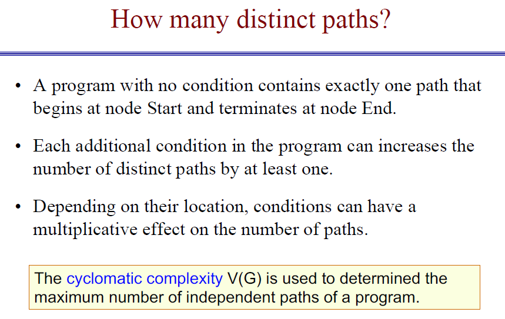 Fig 18 - Control Flow Graph - (<a href='https://www.uc.pt/en/fctuc/dei'>Work by University of Coimbra - DEI - https://www.uc.pt/en/fctuc/dei </a>) 

 

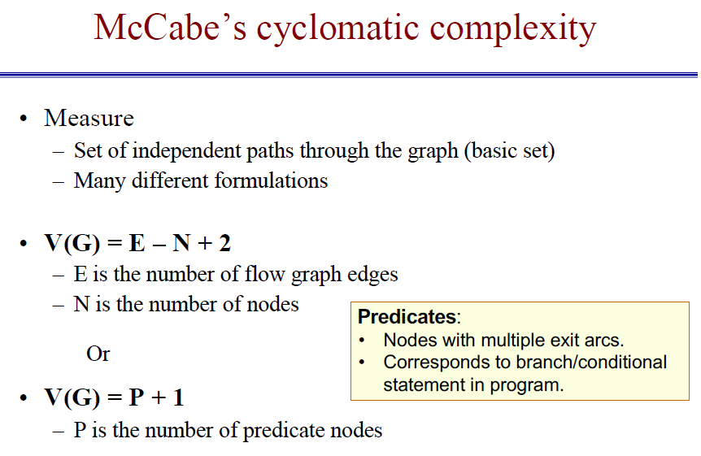 Fig 18 - Control Flow Graph - (<a href='https://www.uc.pt/en/fctuc/dei'>Work by University of Coimbra - DEI - https://www.uc.pt/en/fctuc/dei </a>) 

 

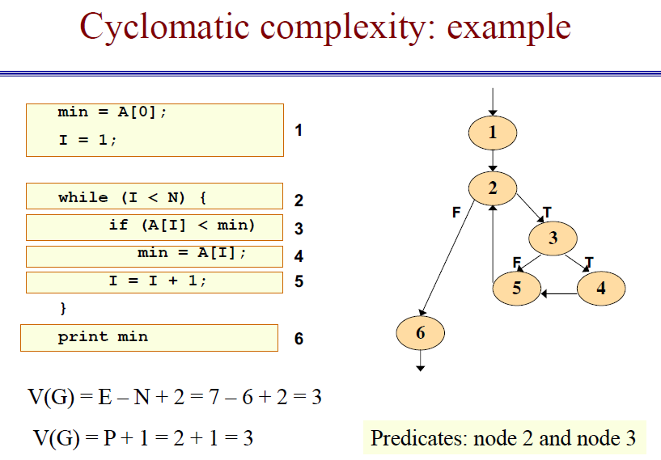 Fig 18 - Control Flow Graph - (<a href='https://www.uc.pt/en/fctuc/dei'>Work by University of Coimbra - DEI - https://www.uc.pt/en/fctuc/dei </a>) 

 

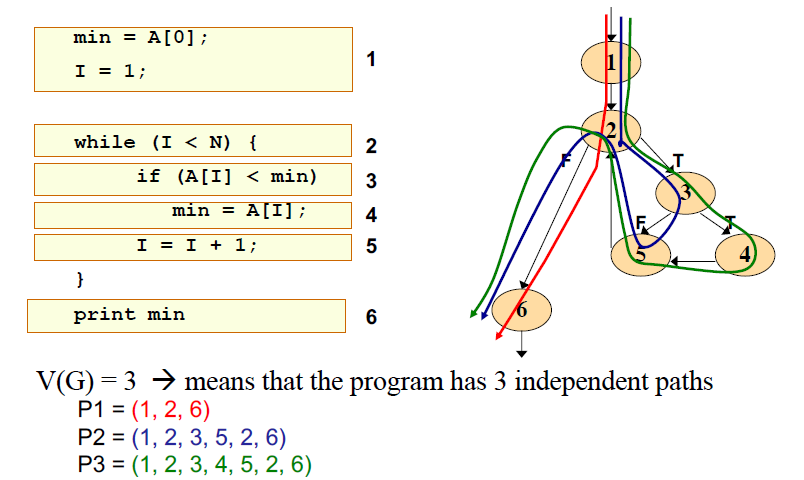 Fig 18 - Control Flow Graph - (<a href='https://www.uc.pt/en/fctuc/dei'>Work by University of Coimbra - DEI - https://www.uc.pt/en/fctuc/dei </a>) 

 

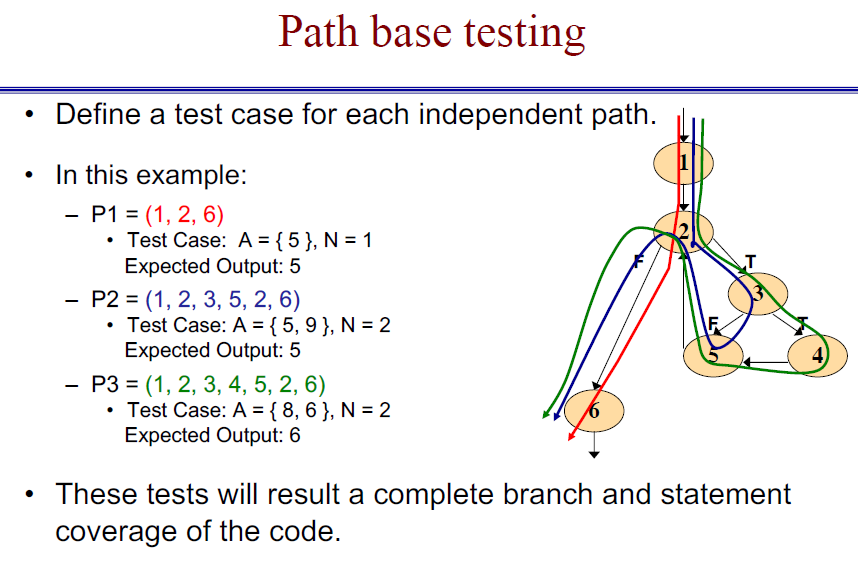 Fig 18 - Control Flow Graph - (<a href='https://www.uc.pt/en/fctuc/dei'>Work by University of Coimbra - DEI - https://www.uc.pt/en/fctuc/dei </a>) 

 

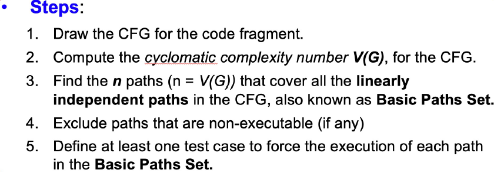 Fig 18 - Control Flow Graph - (<a href='https://www.uc.pt/en/fctuc/dei'>Work by University of Coimbra - DEI - https://www.uc.pt/en/fctuc/dei </a>) 

 

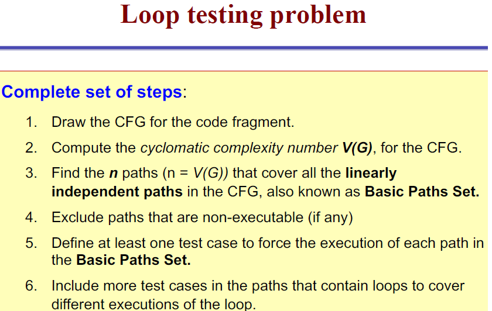 Fig 18 - Control Flow Graph - (<a href='https://www.uc.pt/en/fctuc/dei'>Work by University of Coimbra - DEI - https://www.uc.pt/en/fctuc/dei </a>) 

 

#### Chapter 4 - Part 4: White-box: Data flow testing

- **Data flow testing**: perform a number of tests defined according to data values. These tests are known as data flow testing. There are several (data flow) strategies to decide the tests to be applied to the program/system under test. Execution of certain kinds of paths to uncover anomalies in the flow of data in program variables.
- Can be Static or Dynamic

 

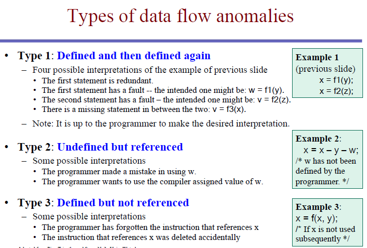 Fig 19 - Data Flow - (<a href='https://www.uc.pt/en/fctuc/dei'>Work by University of Coimbra - DEI - https://www.uc.pt/en/fctuc/dei </a>) 

 

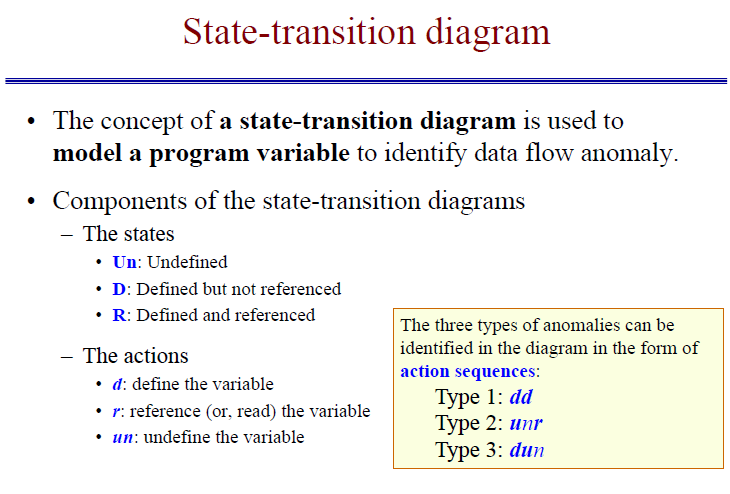 Fig 19 - Data Flow - (<a href='https://www.uc.pt/en/fctuc/dei'>Work by University of Coimbra - DEI - https://www.uc.pt/en/fctuc/dei </a>) 

 

- Data flow anomalies are detected using program instrumentation
    - Insert extra code to monitor the states of variables.
    - If the state sequence contains dd, unr, or dun sequence, a data flow anomaly is detected.
    - Need tools to do that efficiently (and without major risks of inserting unintended bugs).

- What to do after detecting a data flow anomaly?
    - Investigate the cause of the anomaly.
    - To fix an anomaly, the code must be returned to the developers to modify the existing code in order to remove the anomaly.

**Occurrences of variables**

- **Definition**: a variable gets a new value
    - i = x; /* The variable i gets a new value x. */
- **Undefinition or kill**: occurs if the value and the location become unbound (memory location released).
    - Computation use (c-use)
        - Example: x = 2*y; /* y has been used to compute a value of x. */
    - Predicate use (p-use)
        - Example: if (y > 100) { …} /* y has been used in a condition. */
- **Use**: occurs when the value is fetched from the memory location of the variable. There are two forms of uses of a variable.

 

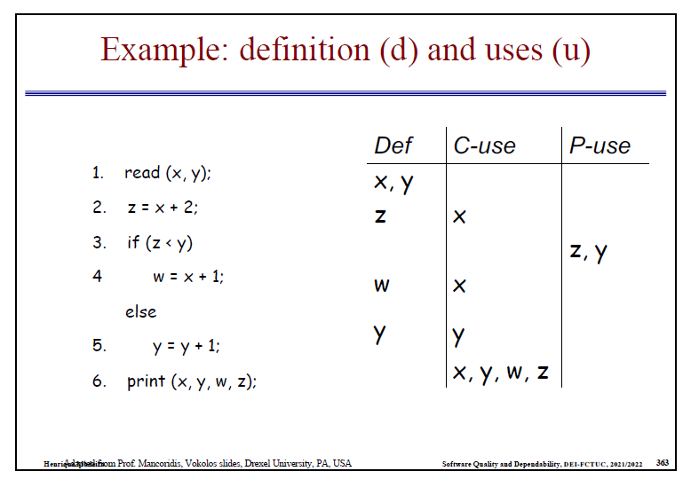 Fig 19 - Data Flow - (<a href='https://www.uc.pt/en/fctuc/dei'>Work by University of Coimbra - DEI - https://www.uc.pt/en/fctuc/dei </a>) 

 

**Data flow graph**

- A data flow graph is a directed graph constructed as follows.
    - A sequence of definitions and c-uses is associated with each node of the graph.
    - A set of p-uses is associated with each edge of the graph.
    - The entry node has a definition of each edge parameter and each nonlocal variable used in the program.
    - The exit node has an undefinition of each local variable.

Key rules to generate the graph:
    - A sequence of definitions and c-uses is associated with each node of the graph.
    - A set of p-uses is associated with each edge of the graph.
    
 

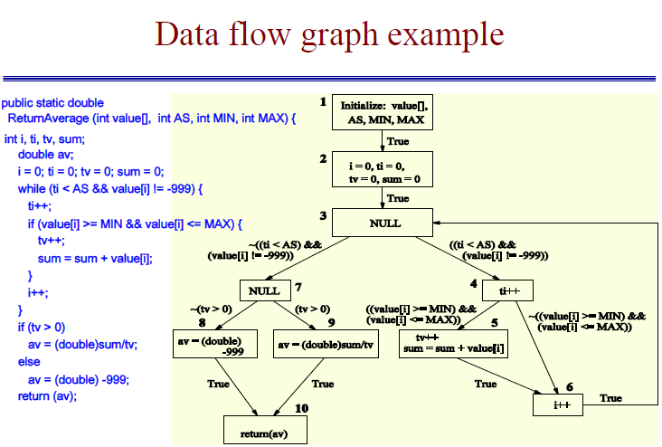 Fig 19 - Data Flow - (<a href='https://www.uc.pt/en/fctuc/dei'>Work by University of Coimbra - DEI - https://www.uc.pt/en/fctuc/dei </a>) 

 

**Data flow terms**

- **Global c-use**: A c-use of a variable ! in node " is said to be a global cuse if ! has been defined before in a node other than node i
    - Example: The c-use of variable /0 in node 5 is a global c-use.

- Definition clear path: A path (i - n1 - ...nm-j), m =>0, is called a definition clear path (def-clear path) with respect to variable x from node i to node j, and from node i to edge (nm,j), if x has been neither defined nor undefined in nodes n1-...nm.
    - Example: (2 – 3 – 4 – 6 – 3 – 4 – 6 – 3 – 4 – 5) is a def-clear path w.r.t. tv.
    - Example: (2 – 3 – 4 – 5) and (2 – 3 – 4 – 6) are def-clear paths w.r.t. variable /0 from node 2 to 5 and from node 2 to 6, respectively.

- **Global definition**: A node " has a global definition of variable x if node i has a definition of x and there is a def-clear path w.r.t. x from node i to some node containing a global c-use, or edge containing a p-use of variable x.

- **Simple path**: A simple path is a path in which all nodes, except possibly the first and the last, are distinct.
    - Example: Paths (2 – 3 – 4 – 5) and (3 – 4 – 6 – 3) are simple paths.

- **Loop-free paths**: A loop-free path is a path in which all nodes are distinct.

- **Complete path**: A complete path is a path from the entry node to the exit node.

- **Du-path**: A path (n1-n2-...-nj-nk) is a du-path path w.r.t. variable x if node n1 has a global definition of x and either
    - node nk has a global c-use of x and (n1 – n2 – … – nj – nk) is a def-clear simple path w.r.t. x, or
    - Edge (nj, nk) has a p-use of x and (n1 – n2 – … – nj – nk) is a def-clear, loop-free path w.r.t. x
    - Example: Considering the global definition and global c-use of variable tv in nodes 2 and 5, respectively, (2 – 3 – 4 – 5) is a du-path.
    - Example: Considering the global definition and p-use of variable tv in nodes 2 and on edge (7, 9), respectively, (2 – 3 – 7 – 9) is a du-path.

**All-defs data flow testing criteria**
    - For each variable x and each node i, such that x has a global definition in node i, select a complete path which includes a defclear path from node i to node j having a global c-use of x, or edge (j,k) having a p-use of x.
    - Example (partial): Consider tv with its global definition in node 2. Variable tv has a global c-use in node 5, and there is a def-clear path (2 – 3 – 4 – 5) from node 2 to node 5. Choose a complete path (1 – 2 – 3 – 4 – 5 – 6 – 3 – 7 – 9 – 10) that includes the defclear path (2 – 3 – 4 – 5) to satisfy the all-defs criterion.
    
**All-c-uses data flow testing criteria**
    - For each variable x and each node i, such that x has a global definition in node i, select complete paths which include def-clear paths from node i to all nodes j such that there is a global c-use of x in j.
    - Example (partial): Consider variable -", which has a global definition in 2 and a global c-use in node 4. From node 2, the defclear path to 4 is (2 – 3 – 4). One may choose the complete path (1 – 2 – 3 – 4 – 6 – 3 – 7 – 8 – 10). (There three other complete paths.)
    
**All-p-uses data flow testing criteria**
    - For each variable x and each node i, such that x has a global definition in node i, select complete paths which include def-clear paths from node i to all edges (j,k) such that there is a p-use of x on (j,k)
    - Example (partial): Consider variable -/, which has a global definition in 2 and p-uses on edges (7, 8) and (7, 9). From node 2, there are def-clear paths to (7, 8) and (7, 9), namely (2 – 3 – 7 – 8) and (2 – 3 – 7 – 9). The two complete paths are: (1 – 2 – 3 – 7 – 8 – 10) and (1 – 2 – 3 – 7 – 9 – 10).
    
**All-p-uses/some-c-us data flow testing criteria**
    - This criterion is identical to the all-p-uses criterion except when a variable x has no p-use. If x has no p-use, then this criterion reduces to the some-c-uses criterion.
    - Some-c-uses: For each variable x and each node i, such that x has a global definition in node i, select complete paths which include defclear paths from node i to some nodes j such that there is a global c-use of x in i.
    - Example (partial): Consider variable ", which has a global definition in 2. There is no p-use of ". Corresponding to the global definition of I in 2, there is a global c-use of I in 6. The def-clear path from node 2 to 6 is (2 – 3 – 4 – 5 – 6). A complete path that includes the above def-clear path is (1 – 2 – 3 – 4 – 5 – 6 – 7 – 9 – 10).
    
 **All-c-uses/some-p-uses data flow testing criteria**
    - This criterion is identical to the all-c-uses criterion except when a variable x has no c-use. If x has no global c-use, then this criterion reduces to the some-p-uses criterion.
    - Some-p-uses: For each variable x and each node i, such that x has a global definition in node i, select complete paths which include def-clear paths from node i to some edges (j,k) such that there is a p-use of x on (j,k)
    
 **All-uses data flow testing criteria**
    - All-uses: This criterion produces a set of paths due to the all-p-uses criterion and the all-c-uses criterion.
    
 **All-du-paths data flow testing criteria**
    - For each variable x and for each node i, such that x has a global definition in node i, select complete paths which include all du-paths from node i
        - to all nodes j such that there is a global c-use of x in j, and
        - to all edges (j,k),. such that there is a p-use of x on (j,k)
        
 

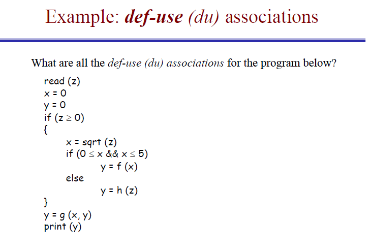 Fig 19 - Data Flow - (<a href='https://www.uc.pt/en/fctuc/dei'>Work by University of Coimbra - DEI - https://www.uc.pt/en/fctuc/dei </a>) 

 

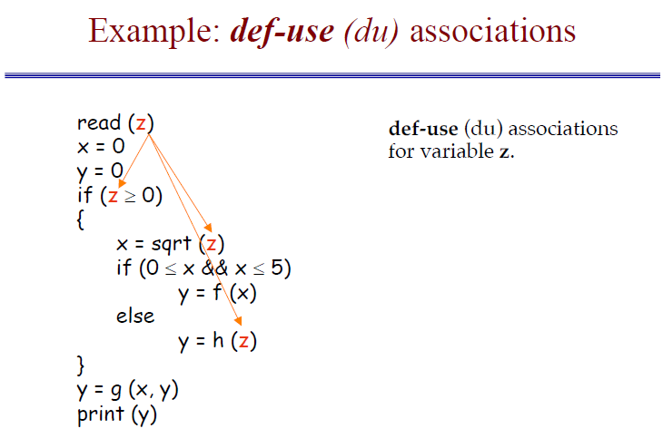 Fig 19 - Data Flow - (<a href='https://www.uc.pt/en/fctuc/dei'>Work by University of Coimbra - DEI - https://www.uc.pt/en/fctuc/dei </a>) 

 

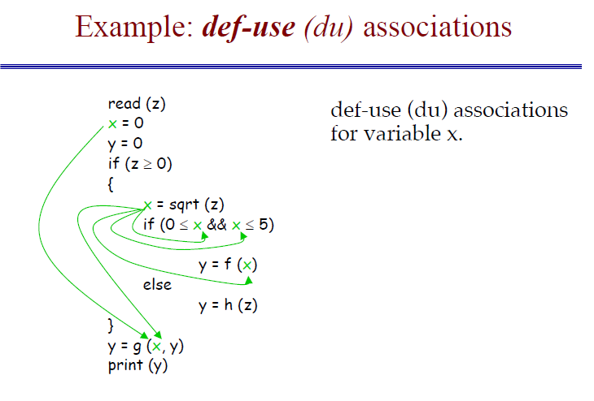 Fig 19 - Data Flow - (<a href='https://www.uc.pt/en/fctuc/dei'>Work by University of Coimbra - DEI - https://www.uc.pt/en/fctuc/dei </a>) 

 

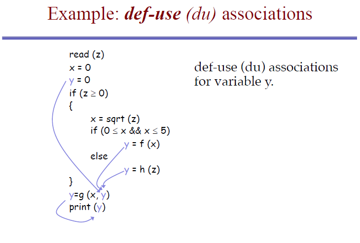 Fig 19 - Data Flow - (<a href='https://www.uc.pt/en/fctuc/dei'>Work by University of Coimbra - DEI - https://www.uc.pt/en/fctuc/dei </a>) 

 

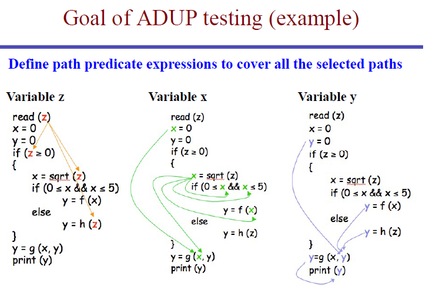 Fig 19 - Data Flow - (<a href='https://www.uc.pt/en/fctuc/dei'>Work by University of Coimbra - DEI - https://www.uc.pt/en/fctuc/dei </a>) 

 

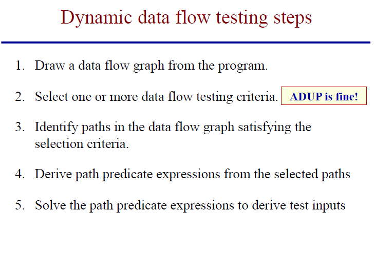 Fig 19 - Data Flow - (<a href='https://www.uc.pt/en/fctuc/dei'>Work by University of Coimbra - DEI - https://www.uc.pt/en/fctuc/dei </a>) 

 
        
#### Chapter 4 - Part 5: Black-box: Equivalence Classes

- Typically the universe of all possible test cases is too large and we cannot try all of them
- We have to select a relatively small number of test cases to actually run

- **Equivalence Classes**: Partition the test cases into "equivalence classes”
    - Each equivalence class contains a set of "equivalent" test cases
    - Two test cases are considered to be equivalent if we expect the program to process them both in the same way (i.e., follow the same path through the code)
    - If we expect the program to process two test cases in the same way, we only test one of them

- **Advantages**
    - As the entire partition is represented in the test cases, it provides a form of completeness
    - As partitions are disjoint, assures non-redundancy in the test cases.
    
- **Disavantages**
    - Needs knowledge of the input domain (more than just understanding the specifications) and requires understanding on how inputs are mutually dependent
    - Largely dependent on the skills of the tester and on his/her knowledge of the application domain.

 

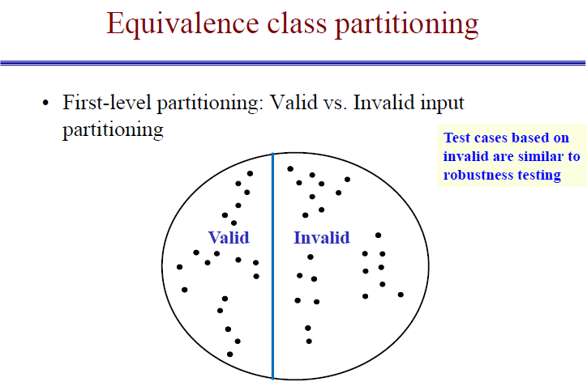 Fig 19 - Black-box: Equivalence Classes - (<a href='https://www.uc.pt/en/fctuc/dei'>Work by University of Coimbra - DEI - https://www.uc.pt/en/fctuc/dei </a>) 

 

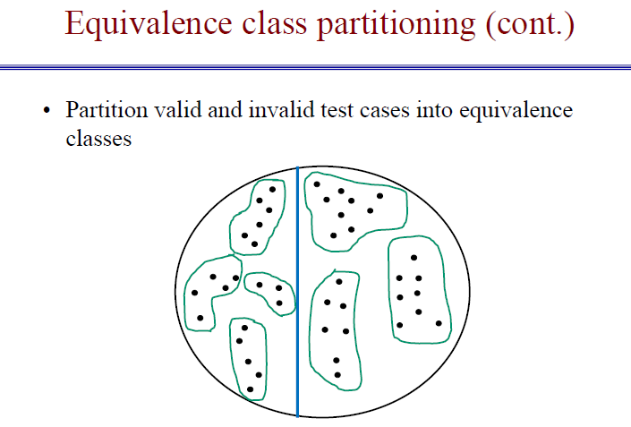 Fig 19 - Black-box: Equivalence Classes - (<a href='https://www.uc.pt/en/fctuc/dei'>Work by University of Coimbra - DEI - https://www.uc.pt/en/fctuc/dei </a>) 

 

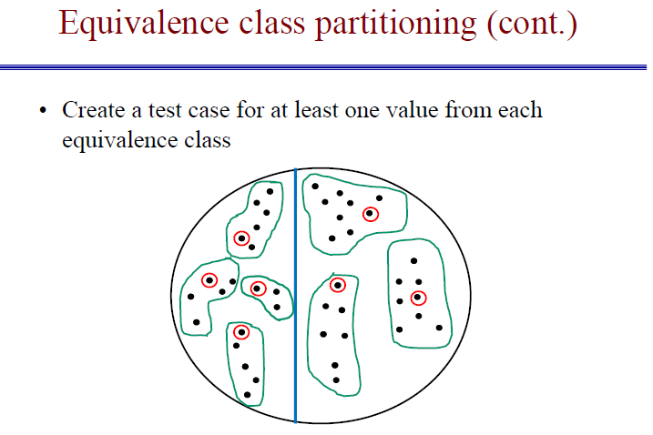 Fig 19 - Black-box: Equivalence Classes - (<a href='https://www.uc.pt/en/fctuc/dei'>Work by University of Coimbra - DEI - https://www.uc.pt/en/fctuc/dei </a>) 

 

- Example: string Fetch(URL)
    - Equivalence Definition 1: partition test cases by URL protocol (“http”, “https”, “ftp”, “file”)
    - Equivalence Definition 2: partition test cases by type of file being retrieved (HTML, GIF, JPEG, Plain Text)
    - Equivalence Definition 3: partition test cases by length of URL (very short, short, medium, long, very long)

 

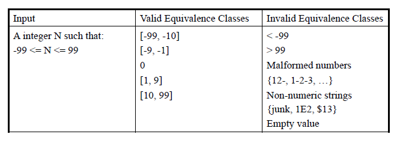 Fig 19 - Black-box: Equivalence Classes - (<a href='https://www.uc.pt/en/fctuc/dei'>Work by University of Coimbra - DEI - https://www.uc.pt/en/fctuc/dei </a>) 

 

#### Chapter 4 - Part 6:  Black-box: Boundary Value Analysis

- When choosing values from an equivalence class to test, we use the values that are most likely to cause the program to fail
- Errors tend to occur at the boundaries of equivalence classes rather than at the "center”
- In addition to testing center values, we should also test boundary values
    - Right on a boundary
    - Very close to a boundary on either side

 

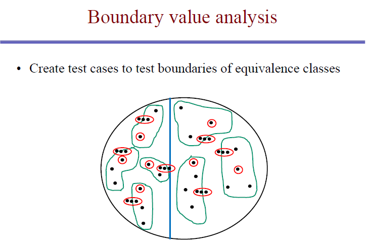 Fig 19 - Black-box: Boundary Value Analysis - (<a href='https://www.uc.pt/en/fctuc/dei'>Work by University of Coimbra - DEI - https://www.uc.pt/en/fctuc/dei </a>) 

 

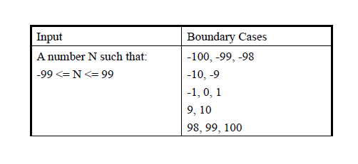 Fig 19 - Black-box: Boundary Value Analysis - (<a href='https://www.uc.pt/en/fctuc/dei'>Work by University of Coimbra - DEI - https://www.uc.pt/en/fctuc/dei </a>) 

 

- Numeric values are often entered as strings which are then converted to numbers internally [int x = atoi(str);]
- This conversion requires the program to distinguish between digits and non-digits
- A boundary case to consider: should the program accept / and : as digits?

#### Chapter 4 - Part 7: Other testing approaches

 

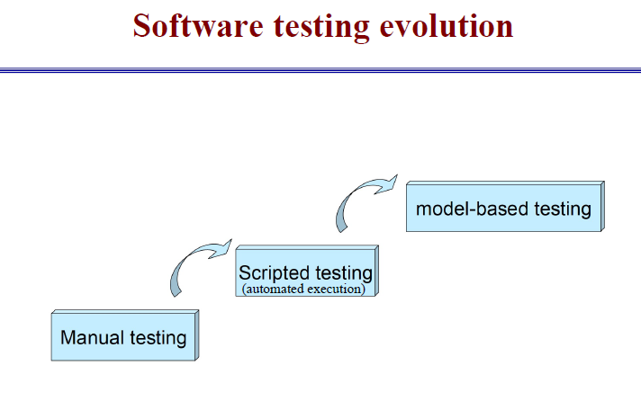 Fig 19 - Teste Evolution - (<a href='https://www.uc.pt/en/fctuc/dei'>Work by University of Coimbra - DEI - https://www.uc.pt/en/fctuc/dei </a>) 

 

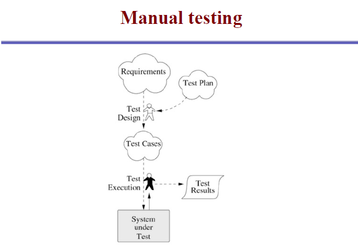 Fig 19 - Teste Evolution - (<a href='https://www.uc.pt/en/fctuc/dei'>Work by University of Coimbra - DEI - https://www.uc.pt/en/fctuc/dei </a>) 

 

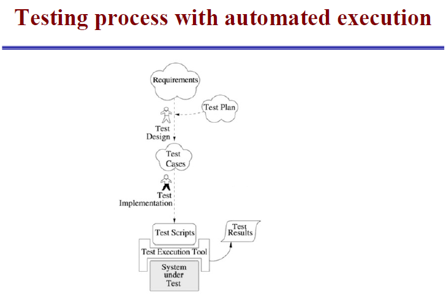 Fig 19 - Teste Evolution - (<a href='https://www.uc.pt/en/fctuc/dei'>Work by University of Coimbra - DEI - https://www.uc.pt/en/fctuc/dei </a>) 

 

**Ad hoc exploratory testing**: 
    - Based on intuition, guess what kinds of inputs might cause the program to fail
    - Create some test cases based on your guesses
    - Intuition will often lead you toward boundary cases, but not always and, above all, not in a structured way.
    - Some special cases are not boundary values, but are mishandled by many programs
        - Try exiting the program while it is still starting up
        - Try loading a corrupted file
        - Try strange but legal URLs: hTtP://Www.bYu.EDU/
        
**Comparison testing**:
    - Also called Back-to-Back testing
    - When having multiple implementations of the same functionality, one can run test inputs through both implementations, and compare the results for equality
    - Why multiple implementations?
        - NVersion programming: safety-critical systems sometimes use multiple, independent implementations of critical modules to ensure the reliability of results
        - Competitor's product, or an earlier version of the product under development
        - Key functionalities implemented in simulation environments or through specific tools
     - Inputs may be randomly generated or designed manually
     
**Testing for race conditions and other timing dependencies**
    - Testing for race conditions and other timing dependencies
        - Operating systems manage concurrent programs, interrupts, etc.
        - Servers service many clients simultaneously
        - Applications let users perform multiple concurrent actions
    - Test a variety of different concurrency scenarios, focusing on activities that are likely to share resources (and therefore conflict)
    - "Race conditions" are bugs that occur only when concurrent activities interleave in particular ways, thus making them difficult to reproduce
    - Test on hardware of various speeds to ensure that your system works well on both slower and faster machines
    
**Performance testing**
    - Measure the system performance
        - Running times of various tasks
        - Throughput (no. of tasks executed by in a given amount of time)
        - Response time
    - Important to exercise:
        - Memory usage, including memory leaks
        - Network usage (Does it consume too much bandwidth? Does it open too many connections?)
        - Disk usage (Is the disk footprint reasonable? Does it clean up temporary files properly?)
        - Process/thread priorities (Does it play well with other applications, or does it hog the whole machine?)
        
 **Limit testing**
    - Test the system at the limits of normal use
    - Test every limit on the program behavior defined in the requirements
        - Maximum number of concurrent users or connections
        - Maximum number of open files
        - Maximum request size
        - Maximum file size
        - Etc.
        
    - What happens when you go slightly beyond the specified limits?
        - Does the system performance degrade dramatically, or gracefully?
        
**Stress testing**
    - Test the system under extreme conditions (i.e., beyond the limits of normal use)
    - Create test cases that demand resources in abnormal quantity, frequency, or volume
        - Low memory conditions
        - Disk faults (read/write failures, full disk, file corruption, etc.)
        - Network faults
        - Unusually high number of requests
        - Unusually large requests or files
        - Unusually high data rates (what happens if the network suddenly becomes ten times faster?)
        
    - Even if the system does not need to work in such extreme conditions, stress testing is an excellent way to find bugs.
    
**Security Testing**
    - Any system that manages sensitive information or performs sensitive functions may become a target for intrusion (i.e., hackers)
    - How feasible is it to break into the system?
    - Learn the techniques used by hackers
    - Try whatever attacks you can think of
    - Hire a security expert to break into the system
    - If somebody broke in, what damage could they do?
    - If an authorized user became disgruntled, what damage could they do?
    
**Usability Testing**
    - Is the user interface intuitive, easy to use, organized, logical?
    - Are common tasks simple to do?
    - Does it conform to platform-specific conventions?
    - Get real users to sit down and use the software to perform some tasks
    - Watch them performing the tasks, noting things that seem to give them trouble
    - Get their feedback on the user interface and any suggested improvements
    - Report bugs for any problems encountered
    
**Recovery testing**
    - Try turning the power off or otherwise crashing the program at arbitrary points during its execution
        - Does the program come back up correctly when you restart it?
        - Was the program persistent data corrupted (files, databases, etc.)?
        - Was the extent of user data loss within acceptable limits?
    - Can the program recover if its configuration files have been corrupted or deleted?
    - What about hardware failures? Does the system need to keep working when its hardware fails? If so, verify that it does so.

#### Chapter 4 - Part 8: Model-based Testing

 

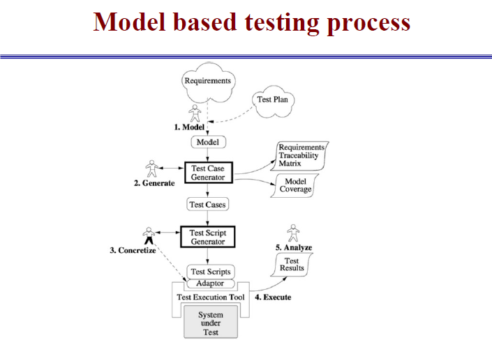 Fig 19 - Model Based Teste - (<a href='https://www.uc.pt/en/fctuc/dei'>Work by University of Coimbra - DEI - https://www.uc.pt/en/fctuc/dei </a>) 

 

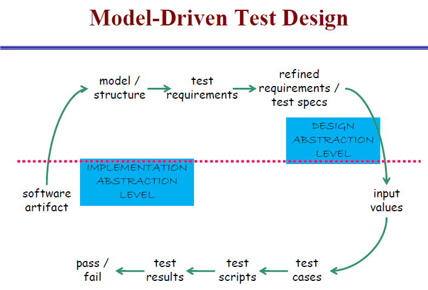 Fig 19 - Model Based Teste - (<a href='https://www.uc.pt/en/fctuc/dei'>Work by University of Coimbra - DEI - https://www.uc.pt/en/fctuc/dei </a>) 

 

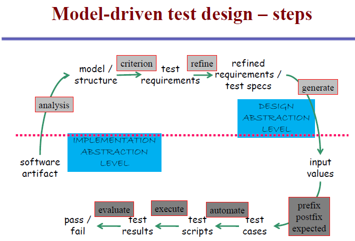 Fig 19 - Model Based Teste - (<a href='https://www.uc.pt/en/fctuc/dei'>Work by University of Coimbra - DEI - https://www.uc.pt/en/fctuc/dei </a>) 

 

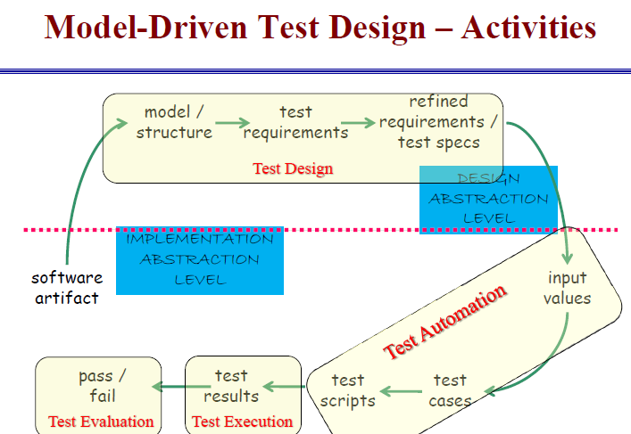 Fig 19 - Model Based Teste - (<a href='https://www.uc.pt/en/fctuc/dei'>Work by University of Coimbra - DEI - https://www.uc.pt/en/fctuc/dei </a>) 

 

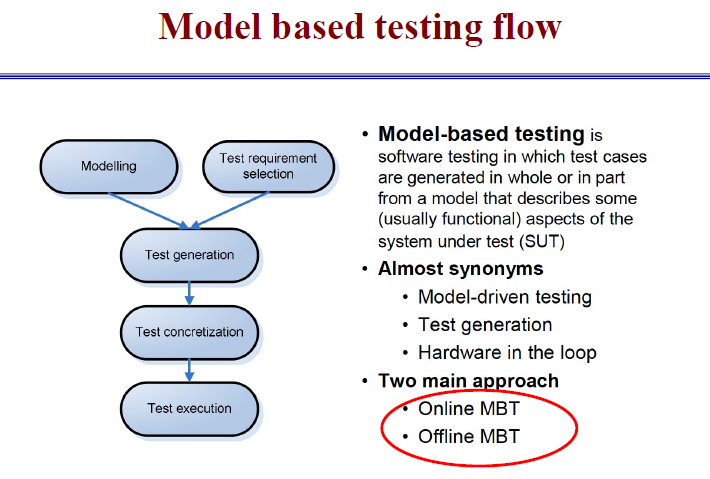 Fig 19 - Model Based Teste - (<a href='https://www.uc.pt/en/fctuc/dei'>Work by University of Coimbra - DEI - https://www.uc.pt/en/fctuc/dei </a>) 

 

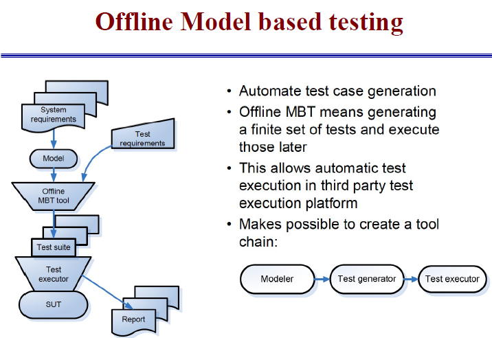 Fig 19 - Model Based Teste - (<a href='https://www.uc.pt/en/fctuc/dei'>Work by University of Coimbra - DEI - https://www.uc.pt/en/fctuc/dei </a>) 

 

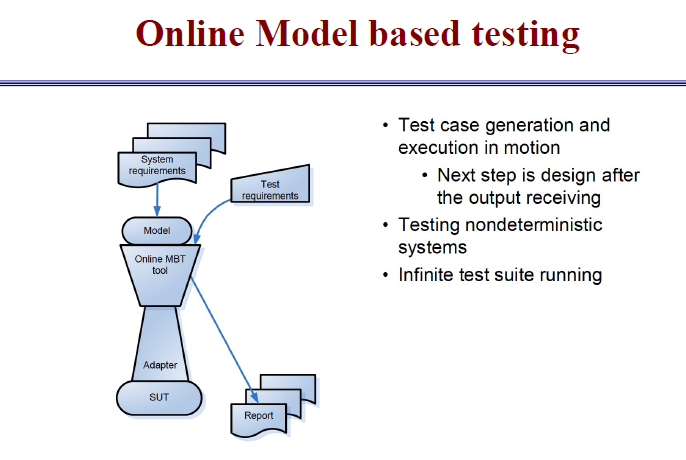 Fig 19 - Model Based Teste - (<a href='https://www.uc.pt/en/fctuc/dei'>Work by University of Coimbra - DEI - https://www.uc.pt/en/fctuc/dei </a>) 

 

#### Chapter 4 - Part 9: Coverage Criteria

#### Chapter 4 - Part 10: Testing Parallel and Distributed Systems

#### Chapter 4 - Part 11: Regression Testing

#### Chapter 4 - Part 12: Defect tracking and ODC

## Chapter 5: Development Models and Standards

#### Chapter 5 - Part 1: Software Life Cycle Processes

#### Chapter 5 - Part 2: Software Product Quality

#### Chapter 5 - Part 3: Test-Driven Development

#### Chapter 5 - Part 4: Contract-Based Specification

## Chapter 6: Development Models and Standards

#### Chapter 6 - Part 1: CMMI (Capability Maturity Model Integration)

#### Chapter 6 - Part 2: Measuring and Estimating Software Quality

#### Chapter 6 - Part 3: Verification and Validation (including non-code artifacts)

#### Chapter 6 - Part 4: Quality Assurance

## Chapter 7: Software Dependability and Security Evaluation

#### Chapter 7 - Part 1: Software Dependability and Security Evaluation

# Bibliography's 

Some of references that I use.

1. [Systems Engineering Body of Knowledge][sebok-url]
2. [Software Quality][sqa-url]
3. [Software Quality Assurance][sqaa-url]
4. [Software Engineering - Computer Notes][swcomputernotes-url]
5. [Software Engineering - Geeks for Geeks][swgeeks-url]
6. [Software Engineering - Java T Point][swjavatpoint-url]

<!-- URL's -->

[sebok-url]:https://www.sebokwiki.org/wiki/Guide_to_the_Systems_Engineering_Body_of_Knowledge_(SEBoK)
[sqa-url]: https://nibmehub.com/opac-service/pdf/read/Software%20quality%20%20concepts%20and%20practice.pdf
[sqaa-url]: http://desy.lecturer.pens.ac.id/Manajemen%20Kualitas%20Perangkat%20Lunak/ebook/Software%20Quality%20Assurance%20From%20Theory%20to%20Implementation.pdf
[swcomputernotes-url]: https://ecomputernotes.com/software-engineering
[swgeeks-url]: https://www.geeksforgeeks.org/software-engineering/?ref=lbp
[swjavatpoint-url]: https://www.javatpoint.com/software-engineering-tutorial
